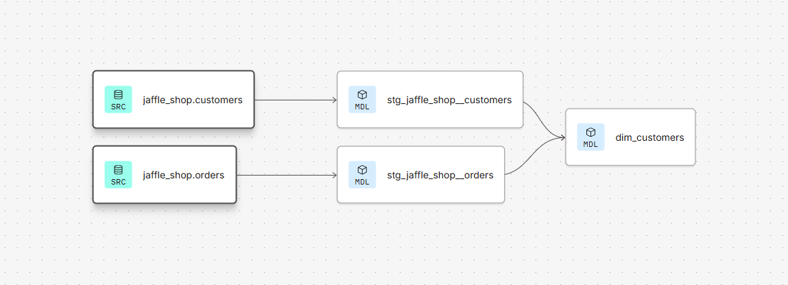

# dbt + Snowflake Analytics Engineering Pipeline

Project demonstrating an end-to-end analytics engineering workflow: raw e-commerce and payments data transformed into clean, tested, documented data marts using **dbt (Fusion engine)** on **Snowflake**.

## Overview

The project models a fictional online store ("Jaffle Shop") with two raw data sources:

- **`jaffle_shop`** - customers and orders (operational data)
- **`stripe`** - payment transactions

Raw data is transformed through a layered dbt architecture (staging → marts) into analytics-ready tables, with automated data quality tests at each layer.

## Project structure

```
models/
├── staging/
│   ├── jaffle_shop/
│   │   ├── stg_jaffle_shop__customers.sql
│   │   ├── stg_jaffle_shop__orders.sql
│   │   ├── _stg_jaffle_shop.yml       # column tests & docs
│   │   ├── _src_jaffle_shop.yml       # source definitions + freshness
│   │   └── jaffle_shop_docs.md
│   └── stripe/
│       ├── stg_stripe__payments.sql
│       └── _src_stripe.yml         # source definitions
└── marts/
    ├── dim_customers.sql               # customer dimension w/ lifetime value
    └── finance/
        └── fct_orders.sql              # orders fact table

tests/
└── assert_stg_stripe__payments_total_positive.sql   # singular test
```

## Data model

**Staging layer** (materialized as views) — light transformations: renaming, type casting, and standardizing raw source columns.

**Marts layer** (materialized as tables):
- `dim_customers` — one row per customer, enriched with order history (`first_order_date`, `most_recent_order_date`, `number_of_orders`) and `lifetime_value` calculated by joining orders to successful Stripe payments.
- `fct_orders` — order-level fact table for financial reporting.

## Lineage


*Lineage for `dim_customers`, showing the join between orders and Stripe payments*

## Data quality & testing

- **Generic tests**: `unique` and `not_null` on primary keys, `accepted_values` on order status, `relationships` to enforce referential integrity between orders and customers.
- **Singular test**: custom assertion that total payment amounts are always non-negative.
- **Source freshness**: configured `warn_after` / `error_after` thresholds on the `jaffle_shop.orders` source to monitor data pipeline SLAs.

Run all tests:
```bash
dbt test
```

Run tests on sources only:
```bash
dbt test --select source:*
```

## Tech stack

- **dbt (Fusion engine)** - transformation, testing, documentation
- **Snowflake** - cloud data warehouse
- **SQL** - CTE-based, modular model design
- **Git** - version control

## Running the project

```bash
dbt deps      # install packages (if any)
dbt seed      # load seed data
dbt run       # build all models
dbt test      # run all data tests
```

Or run everything in dependency order with fail-fast behavior on failed tests:
```bash
dbt build
```
